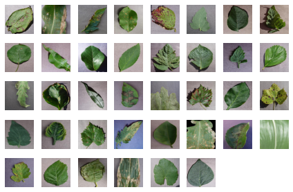
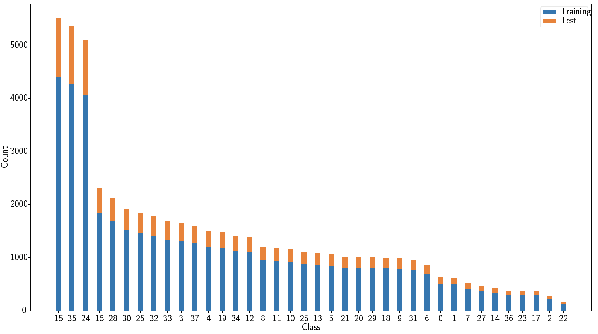
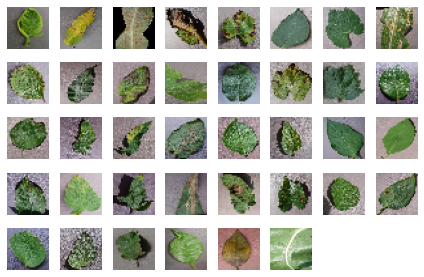
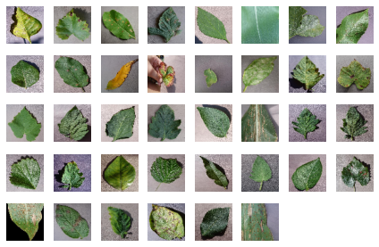
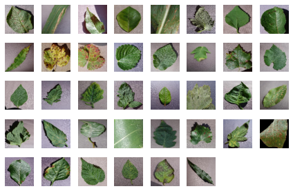

# Downsampled Plant Disease Dataset

# Introduction
The PlantVillage dataset consists of healthy and
infected plant leaves of 14 different species. There are 38 classes, of which
12 correspond to healthy plants and 26 to infected plants.

The names of species are:
>Apple, Blueberry, Cherry, Corn, Grape, Orange, Peach, Bell Pepper, Potato, Raspberry, Soybean, Squash, Strawberry, and Tomato.

The names of the 38 classes are:

1. Apple Scab
2. Apple Black Rot
3. Apple Cedar Rust
4. Apple healthy
5. Blueberry healthy
6. Cherry healthy
7. Cherry Powdery Mildew
8. Corn Gray Leaf Spot
9. Corn Common Rust
10. Corn healthy
11. Corn Northern Leaf Blight
12. Grape Black Rot
13. Grape Black Measles
14. Grape Leaf Blight
15. Grape healthy
16. Orange Huanglongbing
17. Peach Bacterial Spot
18. Peach healthy
19. Bell Pepper Bacterial Spot
20. Bell Pepper healthy
21. Potato Early Blight
22. Potato healthy
23. Potato Late Blight
24. Raspberry healthy
25. Soybean healthy
26. Squash Powdery Mildew
27. Strawberry Healthy
28. Strawberry Leaf Scorch
29. Tomato Bacterial Spot
30. Tomato Early Blight
31. Tomato Late Blight
32. Tomato Leaf Mold
33. Tomato Septoria Leaf Spot
34. Tomato Two Spotted Spider Mite
35. Tomato Target Spot
36. Tomato Mosaic Virus
37. Tomato Yellow Leaf Curl Virus
38. Tomato healthy

The background class is omitted. For detailed information about classes, please refer to [An open access repository of images on plant health to enable the development of mobile disease diagnostics](https://arxiv.org/abs/1511.08060) [1].

The dataset we used to derive our versions of the data can be downloaded from [link](https://data.mendeley.com/datasets/tywbtsjrjv/1) [2] available under license [CC0 1.0](LICENSE). The total number of images is 54305. A sample image from each class of PlantVillage-full (256x256) is shown as:



The original dataset does not contain separate `train` and `test` splits. We make our versions available under the same license, i.e., [CC0 1.0](LICENSE). `5%` from each class is reserved for the `test` split and the remainder is used for the `training` split.  
. The total number of training images is 43456 and the number of test images is 10849. These can be downloaded from 
[plant-full.zip](https://github.com/attaullah/downsampled-plant-disease-dataset/releases).
The histogram showing frequency of training (in blue) and test (in orange) images is shown as:




# Downsampled variants
We have downsampled the original plant leave images from `256x256` to `32x32` , `64x64` and `96x96` respectively. 
All three downsampled variants are used in our papers [3,4]. 
They can be downloaded 
from [releases](https://github.com/attaullah/downsampled-plant-disease-dataset/releases), and can be loaded using `numpy` as:

```python
import numpy as np
file_path = ''  # path to  plant32.npz or plant64.npz or plant96.npz 
npzfile = np.load(file_path)
train_images, train_labels, test_images, test_labels = npzfile['train_images'], npzfile['train_labels'], npzfile[
            'test_images'], npzfile['test_labels']
```

Alternatively, downsampled versions can be generated by using the provided script `downsample_script.py` and an appropriate command line argument, for example, `--name plant32` for 32x32, `--name plant64` and `--name plant96` for 96x96,
by applying the script to the original downloaded file [plant-full.zip](https://github.com/attaullah/downsampled-plant-disease-dataset/releases).
 and setting `data_dir` to the extracted folder containing the `train/` and `test` directories.
```bash
python downsample_script.py --name plant32 --data_dir data/
```
**Note** : For running `downsample_script.py` file,  `absl_py` and `tensorflow` packages are required.

A sample image from each class of PlantVillage (32x32) is shown as:


A sample image from each class of PlantVillage (64x64) is shown as:


A sample image from each class of PlantVillage (96x96) is shown as:



# Citation information
The dataset we use to derive our data from is provided by [1], kindly cite the paper as:
```
@article{geetharamani2019identification,
  title={Identification of plant leaf diseases using a nine-layer deep convolutional neural network},
  author={Geetharamani, G and Pandian, Arun},
  journal={Computers \& Electrical Engineering},
  volume={76},
  pages={323--338},
  year={2019},
  publisher={Elsevier}
}
```
if you use downsampled variants or `train` and `test` splits provided in this repository, kindly cite our paper [4]:
```
@misc{sahito2021better,
      title={Better Self-training for Image Classification through Self-supervision}, 
      author={Attaullah Sahito and Eibe Frank and Bernhard Pfahringer},
      year={2021},
      eprint={2109.00778},
      archivePrefix={arXiv},
      primaryClass={cs.CV}
}
```

# References
1. David. P. Hughes, Marcel Salathe (2016), An open access repository of images on plant health to enable the development of mobile disease diagnostics, [arxiv:1511.08060](https://arxiv.org/abs/1511.08060)
2. J, ARUN PANDIAN; GOPAL, GEETHARAMANI (2019), “Data for: Identification of Plant Leaf Diseases Using a 9-layer Deep Convolutional Neural Network”, Mendeley Data, V1, doi: [10.17632/tywbtsjrjv.1](https://www.sciencedirect.com/science/article/abs/pii/S0045790619300023?via%3Dihub#!)
3. Sahito A., Frank E., Pfahringer B. (2020) Transfer of Pretrained Model Weights Substantially Improves Semi-supervised Image Classification. In: Gallagher M., Moustafa N., Lakshika E. (eds) AI 2020: Advances in Artificial Intelligence. AI 2020 . Lecture Notes in Computer Science, vol 12576. Springer, Cham. [DOI:978-3-030-64984-5_34](https://doi.org/10.1007/978-3-030-64984-5_34)
4. Sahito A., Frank E., Pfahringer B. (2021) Better Self-training for Image Classification through Self-supervision. 	[arXiv:2109.00778](https://arxiv.org/abs/2109.00778)
 
 # LICENSE
 [CC0 1.0](LICENSE)
